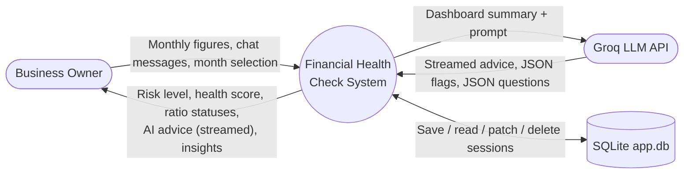
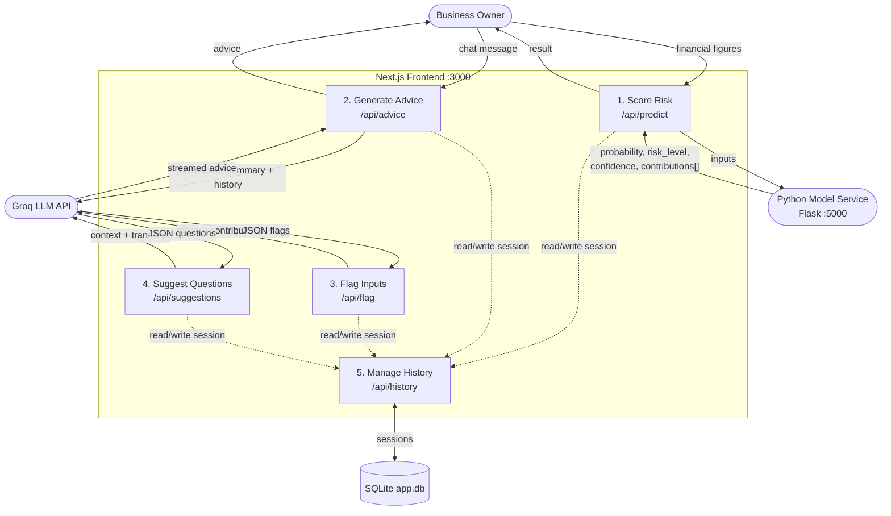

# Financial Health Check — System Architecture

A self-service tool where a small-business owner enters monthly financials, gets a
risk assessment (Low / Medium / High) from a trained model, and chats with an AI
advisor that explains it in plain English.

---

## 1. Overview

The system is split into three tiers with clean responsibilities:

| Tier | Runtime | Port | Responsibility |
| --- | --- | --- | --- |
| **Frontend** | Next.js (App Router, TypeScript) + Tailwind | 3000 | UI, persistence, orchestration of AI + model calls |
| **Model service** | Python / Flask + scikit-learn | 5000 | Stateless risk scoring from a trained logistic `.pkl` |
| **AI provider** | Groq LLM (external API) | — | Advice, input flags, follow-up questions |

**Key design decisions**

- The frontend **never runs the model itself** — it proxies to the Python service, so
  the score always comes from the real trained model.
- The Python model service is **stateless**; the **frontend owns all persistence**
  (it is the only layer that sees the full session: inputs + model result + AI output).
- **Graceful degradation** — without a Groq API key, AI features return empty/disabled
  responses (HTTP 200, not errors) and deterministic threshold rules act as the fallback.

---

## 2. DFD — Level 0 (Context Diagram)



**External entities**

1. **Business Owner** — enters figures, reads the dashboard, chats with the advisor.
2. **Groq LLM API** — external AI provider for advice, flags, and suggested questions.

**Data store**

- **SQLite (`app.db`)** — one prediction session per month (inputs, model result,
  AI flags, advisor conversation, suggestions).

> At Level 0 the Python model service is **inside** the system boundary. It becomes a
> distinct process at Level 1.

---

## 3. DFD — Level 1 (Processes)



| # | Process | Endpoint(s) | Notes |
| --- | --- | --- | --- |
| 1 | **Score Risk** | `POST /api/predict` | Proxies to Flask `POST /predict`. Returns `{probability, risk_level, confidence, contributions[]}`. |
| 2 | **Generate Advice** | `POST /api/advice` | Groq call, **streamed**. Builds a dashboard summary + month-over-month trend. |
| 3 | **Flag Inputs** | `POST /api/flag` | Groq call, JSON. Marks inputs critical / warning / ok. |
| 4 | **Suggest Questions** | `POST /api/suggestions` | Groq call, JSON. 3 follow-up prompts from the live conversation. |
| 5 | **Manage History** | `GET/POST /api/history`, `GET/PATCH/DELETE /api/history/[id]` | CRUD over SQLite via `app/lib/db.ts`. |

---

## 4. Component Architecture

```
financial-risk/
├─ financial-risk-model/          # Python backend + trained model
│  ├─ app.py                      # Flask prediction service (POST /predict, /health)
│  ├─ annual_logistic_model.pkl   # trained LogisticRegression
│  ├─ scoring_info.pkl            # bin intervals + historical default rates
│  └─ requirements.txt
└─ frontend/                      # Next.js + Tailwind UI + AI advisor
   └─ app/
      ├─ api/                     # route handlers (predict, advice, flag, suggestions, history)
      ├─ components/              # Dashboard, AdvisorChat, gauges, charts, tables
      ├─ lib/                     # db, scoring, insights, monthly, history, useAdvisor
      ├─ page.tsx                 # dashboard (latest month)
      ├─ status/                  # monthly data-entry form
      └─ history/                 # past sessions
```

---

## 5. Data Model

**Store:** SQLite, single file (`frontend/data/app.db`), WAL journaling.
**Table:** `predictions` — one row per month (`YYYY-MM`, unique index → HTTP 409 on
duplicate; delete to re-enter).

| Column | Type | Meaning |
| --- | --- | --- |
| `id` | INTEGER PK | auto-increment |
| `created_at`, `assessed_on`, `month` | TEXT | timestamps / `YYYY-MM` |
| `figures` | JSON | raw dollar inputs (`MonthlyFigures`) |
| `inputs` | JSON | the 6 computed ratios scored/shown |
| `probability`, `risk_level`, `confidence`, `risk_index` | REAL/TEXT/INT | model result |
| `contributions` | JSON | per-feature risk contributions |
| `ai_flags`, `messages`, `suggestions` | JSON | AI output, patched in asynchronously |

The DB connection is cached on `globalThis` so Next.js dev hot-reload doesn't reopen
the file; schema setup/migration is idempotent and runs on every module load.

---

## 6. The Model

- Trained **LogisticRegression**; each raw ratio is **binned** to the historical default
  rate of its bin, then fed to the model.
- **Uses 4 of the 6 collected inputs**: `return_on_assets`, `profit_margin`,
  `interest_coverage`, `debt_to_equity_ratio` are scored drivers.
  `current_ratio` and `quick_ratio` are collected/displayed but **not scored** (the UI
  flags this). Two further model features — `fixed asset turnover`, `total debt / ebitda`
  — are **hardcoded constants** (baseline shift, not user-controllable).
- **Explainability:** because the model is linear, each feature's push on the log-odds is
  exactly `coef × bin_rate` — a real explanation, not a heuristic.
- **Risk thresholds** (`>= 0.038` HIGH, `>= 0.023` MEDIUM) are calibrated to the model's
  narrow real output range (~1.7–5.6%). This is a documented **stopgap**; proper
  calibration would come from retraining on the score distribution.

---

## 7. Key Runtime Flows

**First assessment of a month**
1. Owner submits figures → `POST /api/predict` → Flask returns the score.
2. Session saved immediately → `POST /api/history` (returns `id`).
3. In parallel, AI enriches the record and is **PATCHed** in as it lands:
   opening advice (streamed), input flags, suggested questions.
4. Dashboard renders the result; the advisor thread is live.

**Returning to an existing month**
- `page.tsx` loads the latest month, then either **resumes** the advisor thread
  (if messages exist) or **begins** a fresh assessment + flags.

**Async patch pattern** — the prediction is persisted first; AI data (flags, chat,
suggestions) is streamed in and PATCHed onto the record fire-and-forget, so a failed
save never blocks the UI.

---

## 8. Configuration & External Dependencies

| Variable | Purpose |
| --- | --- |
| `GROQ_API_KEY` | Enables AI advice / flags / suggestions (score works without it). |
| `MODEL_API_URL` | Where the Flask service runs (default `http://localhost:5000`). |

- **AI model:** `openai/gpt-oss-120b` via `groq-sdk`. Advice is streamed; flags &
  suggestions use JSON response format. Reply size is capped to stay under the Groq
  free-tier 8k tokens/minute limit.
- **Frontend deps:** `next`, `react`, `tailwindcss`, `better-sqlite3`, `groq-sdk`.
- **Backend deps:** `flask`, `scikit-learn`, `pandas`, `numpy`, `joblib`.
